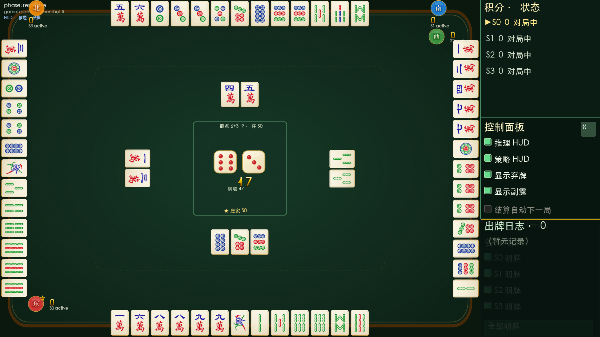
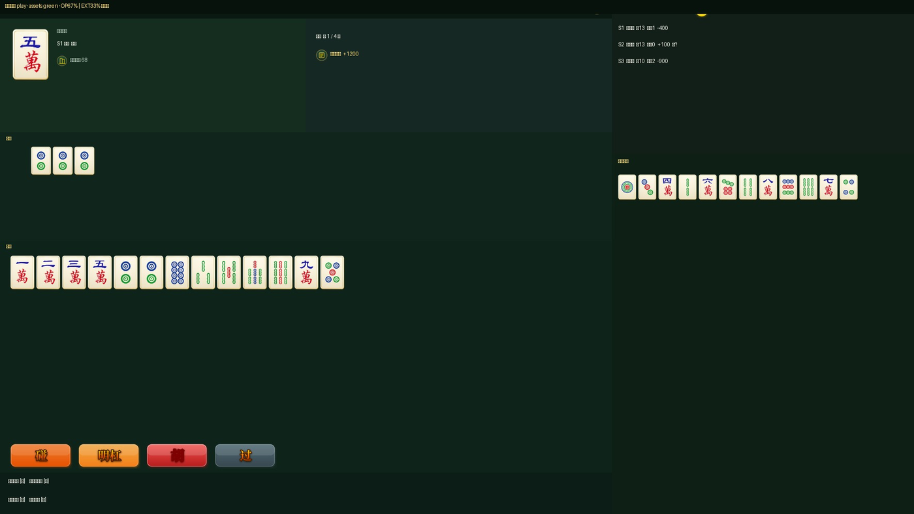
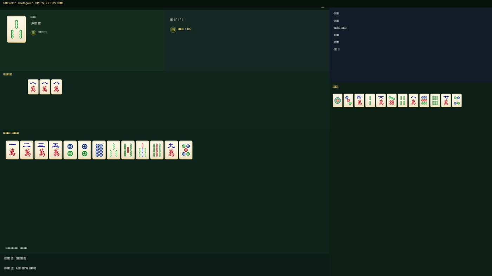
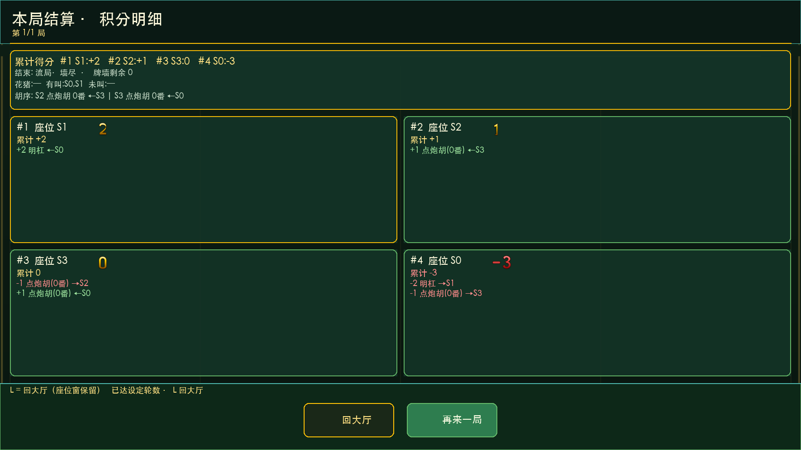

# 成都麻将 AI 训练器

成都麻将（四川血战到底）规则引擎、可视化对局程序与 AI 训练/评估框架。

当前稳定版本：**v0.3.2** · [查看 Release](https://github.com/moff1022-git/chengdu_majiang_AItrainer/releases/tag/v0.3.2) · [版本变更](docs/changelog.md)

## 下载 v0.3.2

当前提供 Apple Silicon（arm64）macOS 应用。两个版本功能相同，优先使用 PyInstaller 版；均为未签名构建。

| 构建 | 下载 | SHA-256 |
|---|---|---|
| PyInstaller | [macOS arm64 ZIP](https://github.com/moff1022-git/chengdu_majiang_AItrainer/releases/download/v0.3.2/ChengduMahjongAITrainer-0.3.2-macOS-arm64-PyInstaller.zip) | `768bc96a7cfb9fc03d81687629cb50d7d64ceb92ef40f3ec9928905d5ff6f6b8` |
| Nuitka | [macOS arm64 ZIP](https://github.com/moff1022-git/chengdu_majiang_AItrainer/releases/download/v0.3.2/ChengduMahjongAITrainer-0.3.2-macOS-arm64-Nuitka.zip) | `c1626970f64373372588af8265c0a68224592549b2582de6038de81be484f6cc` |
| 源码归档 | [v0.3.2-source.zip](https://github.com/moff1022-git/chengdu_majiang_AItrainer/releases/download/v0.3.2/v0.3.2-source.zip) | `9bfff482057a64a162abf861b24534db2b0a992bfa161a6415955485417d3c0d` |
| 证据归档 | [v0.3.2-evidence.zip](https://github.com/moff1022-git/chengdu_majiang_AItrainer/releases/download/v0.3.2/v0.3.2-evidence.zip) | `2d1ee3ae11fa57a5909f161044b536fcfb64e6e24cb93ba14d1446eee984a24d` |
| 校验文件 | [SHA256SUMS.json](https://github.com/moff1022-git/chengdu_majiang_AItrainer/releases/download/v0.3.2/SHA256SUMS.json) | — |

解压后打开 `ChengduMahjongAITrainer.app`。若 macOS Gatekeeper 阻止未签名应用，可在确认下载来源后执行：

```bash
xattr -cr ChengduMahjongAITrainer.app
open ChengduMahjongAITrainer.app
```

Nuitka 版建议放在 `/Applications` 等纯英文路径运行。当前包未进行 Apple Developer ID 签名或公证。

## v0.3.2 主要更新

对比条件统一为相同固定牌局、s0实验玩家、s1–s3 `novice_balanced`；实验组为`nonhuman_optimized`，对照组为`expert_balanced`。

| 对比阶段 | 数据规模 | Nonhuman − Expert总分 | 配对均分差 | 95% CI | 结论 |
|---|---:|---:|---:|---:|---|
| 参数晋级验证 | 3组固定数据、合9000局 | `+977` | `+0.10856` | `[+0.06544,+0.15233]` | 3个数据集全部正向，正式参数晋级 |
| 独立防回退盲测 | 2个独立SHA、合11000局 | `+1036` | `+0.09418` | `[+0.04991,+0.13755]` | CI下界高于0，防回退门禁PASS |

11000局独立盲测的行为护栏差值（Nonhuman − Expert）：

| 胡牌 | 自摸 | 花猪 | 点炮 |
|---:|---:|---:|---:|
| `+154` | `+74` | `-16` | `-28` |

`+胡牌/+自摸`与`-花猪/-点炮`均为期望改善方向。这些结果证明当前规则、阵容和预注册数据下的稳定优势，不表示理论全局最优。

- 新增手动Nonhuman防回退workflow，支持受控artifact和SHA-256校验。
- 完善固定牌局、安全中断/续跑、完整trace和报告一致性门禁。
- macOS PyInstaller/Nuitka双构建均通过冻结程序和资源冒烟测试。
- 详细资料：[Nonhuman优化历程](docs/releases/V0.3.2_NONHUMAN_OPTIMIZATION.md) · [13种人格及旧Nonhuman 7+12参数矩阵](docs/releases/V0.3.2_PERSONALITY_PARAMETER_MATRIX.md)

## 主要能力

- 完整成都麻将规则：108 张牌、换三张、定缺、血战到底、一炮多响、碰杠胡与成都番型计分。
- 四座独立界面：支持人类玩家、AI 玩家和观战窗口，同屏展示牌桌、手牌、弃牌与事件日志。
- 四种玩家：`human`、`rule_ai`、`rule_ai_plus`、`humanlike_v2`，另保留 `random` 用于测试和训练。
- Humanlike v2：认知、记忆、候选行动、风险评估与人格修正决策链。
- 13 种人格预设：12 种人类能力/风格组合，加 `nonhuman_optimized` 实验预设。
- 双层人格雷达图：四座配置同屏，显示 12 项风格参数与 7 项水平参数，支持切换动画和参数说明。
- 人类出牌推荐：可在设置窗口选择 `rule_ai`、`rule_ai_plus` 或 `humanlike_v2`；Humanlike 推荐可选择人格预设并持久化。
- 可复现对局：`game_id` 驱动确定性随机流程，支持存档、回放、JSONL trace 和训练环境。

## 界面预览

| 大厅 | 主牌桌 |
|:---:|:---:|
|  |  |

| 人类玩家 | AI 观战 |
|:---:|:---:|
|  |  |



## 从源码运行

要求 Python 3.11+；推荐 Python 3.12。macOS 的 Tk 座位窗口需要 `python-tk@3.12`。

```bash
git clone https://github.com/moff1022-git/chengdu_majiang_AItrainer.git
cd chengdu_majiang_AItrainer
bash tools/setup_venv.sh
.venv/bin/python main.py --version
.venv/bin/python main.py
```

常用命令：

```bash
# 1 人类 + 3 个 Humanlike v2
.venv/bin/python main.py play \
  --players human,humanlike_v2,humanlike_v2,humanlike_v2 \
  --theme green

# 四 AI 观战
.venv/bin/python main.py play \
  --players humanlike_v2,rule_ai_plus,rule_ai,humanlike_v2 \
  --theme blue

# 无界面训练/批跑
.venv/bin/python main.py train \
  --games 20 \
  --players humanlike_v2,rule_ai_plus,rule_ai,random \
  --log-dir logs/demo \
  --seed 0
```

运行日志：

- macOS：`~/Library/Application Support/ChengduMahjongAITrainer/logs/`
- Windows：`%APPDATA%\ChengduMahjongAITrainer\logs\`

## 本地构建 macOS 应用

```bash
bash tools/packaging/build_pyinstaller_macos.sh
bash tools/packaging/build_nuitka_macos.sh
```

两个脚本会打入并强制校验：

- `assets/`
- `configs/`
- `players/humanlike/parameter_registry_v2.json`
- `--version` 与 `--seat-window --help` 冒烟路径

详细说明：[macOS 打包指南](docs/packaging/MACOS_BUILD.md) · [F0021 规格](docs/features/F0021_macos_packaging.md)

## 测试

```bash
.venv/bin/python -m pytest -q
```

v0.3.2 发布基线：**530 passed, 1 skipped, 0 failed**；GitHub Actions run `31063883299` 成功。

## 项目结构

```text
engine/       权威规则、状态机、结算与存档
players/      Human、Rule AI、Humanlike v2 与推荐逻辑
display/      Pygame 主界面
protocols/    座位子进程通信与玩家视图
training/     批跑、环境、数据与模型工具
configs/      规则、策略与 Humanlike 配置
assets/       牌面与 UI 资源
tests/        单元、场景与集成测试
docs/         规格、ADR、开发流程与状态基线
```

## 文档入口

- [系统设计](PLAN.md)
- [开发与 Docs-First 规范](docs/DEVELOPMENT.md)
- [当前状态](docs/status/LATEST.md)
- [版本规则](docs/VERSIONING.md)
- [变更记录](docs/changelog.md)
- [成都麻将 AI 人类化决策规则 v1](docs/成都麻将AI人类化决策规则_v1.md)

规则裁决以 `engine/` 为权威；玩家只通过合法动作接口决策，Humanlike 不读取对手暗手、未来牌墙或其他不可见信息。
