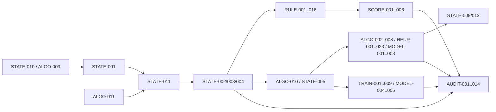

# UNIT-CATALOG 1.0.0 依赖图

| 字段 | 内容 |
|---|---|
| 目录版本 | `UNIT-CATALOG 1.0.0` |
| 状态 | Locked |
| 节点 | 96 |
| 直接依赖边 | 221 |

## 1. 依赖方向

`A → B` 表示 B 直接依赖 A。依赖只表示实现/验收前置，不授权 B 读取 A 的隐藏信息。

## 2. 分层主干

```text
STATE-010 + ALGO-009 + ALGO-011
        │
        ├─→ STATE-001 ─→ STATE-011 ─→ STATE-002/003/004
        │                         │
        │                         ├─→ RULE-001…016
        │                         └─→ SCORE-001…006
        └─→ ALGO-010 ─→ STATE-005 ─→ ALGO/HEUR/MODEL 决策层
                                      │
                                      ├─→ TRAIN-001…009
                                      └─→ AUDIT-001…014
```

## 3. 重要约束

- RULE/SCORE 可读权威状态；HEUR/MODEL-001…003 只能读 PlayerView 和策略私有认知。
- TRAIN 复用生产规则，不维护第二套状态转换。
- AUDIT 可保留私有真值作验证，但不得回流给被测策略。
- MODEL-005 的冻结产物必须通过 AUDIT-011/012，不得直接覆盖生产策略。

## 4. Mermaid 类别图



## 5. 全量直接边

| 上游 | 下游 |
|---|---|
| ALGO-001 | ALGO-003 |
| ALGO-001 | AUDIT-005 |
| ALGO-001 | RULE-002 |
| ALGO-001 | STATE-003 |
| ALGO-002 | ALGO-007 |
| ALGO-002 | HEUR-001 |
| ALGO-002 | HEUR-002 |
| ALGO-002 | HEUR-004 |
| ALGO-002 | HEUR-009 |
| ALGO-002 | HEUR-011 |
| ALGO-002 | HEUR-012 |
| ALGO-002 | HEUR-014 |
| ALGO-002 | RULE-004 |
| ALGO-002 | RULE-010 |
| ALGO-003 | ALGO-004 |
| ALGO-003 | ALGO-007 |
| ALGO-003 | HEUR-001 |
| ALGO-003 | MODEL-001 |
| ALGO-003 | MODEL-002 |
| ALGO-004 | MODEL-002 |
| ALGO-005 | ALGO-007 |
| ALGO-005 | HEUR-009 |
| ALGO-006 | HEUR-021 |
| ALGO-006 | HEUR-023 |
| ALGO-006 | STATE-012 |
| ALGO-007 | AUDIT-002 |
| ALGO-007 | HEUR-010 |
| ALGO-007 | HEUR-021 |
| ALGO-007 | HEUR-023 |
| ALGO-008 | AUDIT-004 |
| ALGO-008 | HEUR-017 |
| ALGO-008 | HEUR-023 |
| ALGO-009 | AUDIT-011 |
| ALGO-009 | RULE-001 |
| ALGO-009 | STATE-001 |
| ALGO-009 | STATE-007 |
| ALGO-010 | AUDIT-013 |
| ALGO-010 | STATE-005 |
| ALGO-010 | TRAIN-002 |
| ALGO-011 | ALGO-008 |
| ALGO-011 | AUDIT-007 |
| ALGO-011 | STATE-001 |
| ALGO-011 | STATE-011 |
| ALGO-011 | TRAIN-009 |
| AUDIT-001 | AUDIT-003 |
| AUDIT-001 | AUDIT-014 |
| AUDIT-002 | AUDIT-003 |
| AUDIT-002 | AUDIT-014 |
| AUDIT-003 | AUDIT-004 |
| AUDIT-004 | AUDIT-009 |
| AUDIT-005 | AUDIT-006 |
| AUDIT-005 | AUDIT-007 |
| AUDIT-006 | AUDIT-008 |
| AUDIT-006 | AUDIT-011 |
| AUDIT-009 | AUDIT-012 |
| AUDIT-010 | AUDIT-008 |
| AUDIT-010 | AUDIT-011 |
| AUDIT-011 | MODEL-005 |
| AUDIT-014 | AUDIT-012 |
| AUDIT-014 | TRAIN-008 |
| HEUR-004 | HEUR-005 |
| HEUR-005 | HEUR-010 |
| HEUR-005 | HEUR-014 |
| HEUR-006 | HEUR-007 |
| HEUR-008 | HEUR-009 |
| HEUR-008 | HEUR-010 |
| HEUR-015 | HEUR-018 |
| HEUR-016 | HEUR-018 |
| HEUR-019 | HEUR-021 |
| HEUR-020 | HEUR-016 |
| HEUR-020 | MODEL-001 |
| HEUR-020 | MODEL-003 |
| HEUR-022 | HEUR-003 |
| HEUR-022 | HEUR-004 |
| HEUR-022 | HEUR-015 |
| HEUR-022 | HEUR-017 |
| HEUR-022 | HEUR-023 |
| MODEL-001 | HEUR-007 |
| MODEL-001 | MODEL-002 |
| MODEL-002 | HEUR-013 |
| MODEL-002 | HEUR-015 |
| MODEL-004 | MODEL-005 |
| MODEL-005 | AUDIT-012 |
| RULE-001 | ALGO-006 |
| RULE-001 | AUDIT-005 |
| RULE-001 | RULE-007 |
| RULE-001 | RULE-008 |
| RULE-001 | RULE-010 |
| RULE-001 | RULE-013 |
| RULE-001 | STATE-009 |
| RULE-001 | TRAIN-001 |
| RULE-001 | TRAIN-003 |
| RULE-002 | HEUR-001 |
| RULE-003 | HEUR-002 |
| RULE-003 | HEUR-014 |
| RULE-004 | SCORE-004 |
| RULE-005 | ALGO-005 |
| RULE-005 | RULE-014 |
| RULE-007 | HEUR-012 |
| RULE-007 | RULE-013 |
| RULE-008 | HEUR-013 |
| RULE-008 | RULE-009 |
| RULE-008 | SCORE-003 |
| RULE-009 | HEUR-013 |
| RULE-009 | RULE-013 |
| RULE-009 | SCORE-003 |
| RULE-010 | RULE-009 |
| RULE-010 | RULE-011 |
| RULE-010 | RULE-012 |
| RULE-010 | RULE-013 |
| RULE-010 | RULE-014 |
| RULE-010 | SCORE-002 |
| RULE-013 | TRAIN-007 |
| RULE-015 | HEUR-011 |
| RULE-015 | SCORE-002 |
| RULE-015 | SCORE-004 |
| RULE-015 | SCORE-005 |
| RULE-016 | ALGO-010 |
| RULE-016 | AUDIT-013 |
| RULE-016 | MODEL-003 |
| SCORE-001 | AUDIT-005 |
| SCORE-001 | SCORE-002 |
| SCORE-001 | SCORE-003 |
| SCORE-001 | SCORE-004 |
| SCORE-001 | SCORE-006 |
| SCORE-001 | TRAIN-005 |
| SCORE-002 | SCORE-005 |
| SCORE-003 | HEUR-013 |
| SCORE-003 | SCORE-005 |
| SCORE-004 | SCORE-005 |
| SCORE-005 | SCORE-006 |
| SCORE-006 | HEUR-008 |
| SCORE-006 | STATE-008 |
| STATE-001 | HEUR-003 |
| STATE-001 | HEUR-008 |
| STATE-001 | SCORE-006 |
| STATE-001 | STATE-004 |
| STATE-001 | STATE-006 |
| STATE-001 | STATE-008 |
| STATE-001 | TRAIN-001 |
| STATE-002 | ALGO-010 |
| STATE-002 | AUDIT-001 |
| STATE-002 | RULE-001 |
| STATE-002 | RULE-005 |
| STATE-002 | SCORE-001 |
| STATE-002 | STATE-003 |
| STATE-002 | STATE-007 |
| STATE-003 | ALGO-002 |
| STATE-003 | RULE-002 |
| STATE-003 | RULE-003 |
| STATE-003 | RULE-004 |
| STATE-003 | RULE-007 |
| STATE-003 | RULE-008 |
| STATE-003 | RULE-010 |
| STATE-003 | RULE-011 |
| STATE-004 | AUDIT-001 |
| STATE-004 | AUDIT-005 |
| STATE-004 | RULE-006 |
| STATE-004 | RULE-014 |
| STATE-004 | RULE-016 |
| STATE-004 | STATE-002 |
| STATE-004 | STATE-009 |
| STATE-004 | TRAIN-001 |
| STATE-005 | ALGO-003 |
| STATE-005 | HEUR-006 |
| STATE-005 | HEUR-007 |
| STATE-005 | HEUR-016 |
| STATE-005 | HEUR-020 |
| STATE-005 | MODEL-001 |
| STATE-005 | STATE-006 |
| STATE-005 | STATE-009 |
| STATE-005 | TRAIN-002 |
| STATE-006 | AUDIT-002 |
| STATE-006 | HEUR-005 |
| STATE-006 | HEUR-019 |
| STATE-006 | HEUR-020 |
| STATE-006 | HEUR-022 |
| STATE-006 | STATE-008 |
| STATE-007 | AUDIT-004 |
| STATE-007 | AUDIT-011 |
| STATE-008 | MODEL-003 |
| STATE-009 | ALGO-006 |
| STATE-009 | ALGO-008 |
| STATE-009 | AUDIT-002 |
| STATE-009 | HEUR-017 |
| STATE-009 | HEUR-019 |
| STATE-009 | STATE-012 |
| STATE-009 | TRAIN-003 |
| STATE-010 | ALGO-007 |
| STATE-010 | ALGO-009 |
| STATE-010 | ALGO-011 |
| STATE-010 | HEUR-003 |
| STATE-010 | HEUR-022 |
| STATE-010 | RULE-001 |
| STATE-010 | RULE-015 |
| STATE-010 | RULE-016 |
| STATE-010 | STATE-001 |
| STATE-010 | STATE-006 |
| STATE-010 | TRAIN-009 |
| STATE-011 | ALGO-001 |
| STATE-011 | ALGO-004 |
| STATE-011 | ALGO-005 |
| STATE-011 | RULE-002 |
| STATE-011 | RULE-006 |
| STATE-011 | RULE-008 |
| STATE-011 | RULE-012 |
| STATE-011 | STATE-002 |
| TRAIN-001 | AUDIT-013 |
| TRAIN-001 | TRAIN-006 |
| TRAIN-002 | MODEL-004 |
| TRAIN-002 | TRAIN-005 |
| TRAIN-002 | TRAIN-006 |
| TRAIN-002 | TRAIN-008 |
| TRAIN-003 | MODEL-004 |
| TRAIN-003 | TRAIN-004 |
| TRAIN-003 | TRAIN-006 |
| TRAIN-003 | TRAIN-008 |
| TRAIN-005 | TRAIN-006 |
| TRAIN-006 | AUDIT-009 |
| TRAIN-006 | TRAIN-007 |
| TRAIN-008 | MODEL-005 |

## 6. 验收规则

- 所有边两端必须存在于 `locked_unit_catalog.csv`。
- 详细单元规格不得新增未登记上游；需新增时必须先升级 UNIT-CATALOG。
- 实现完成并不意味下游自动通过；每个节点必须有独立证据。
