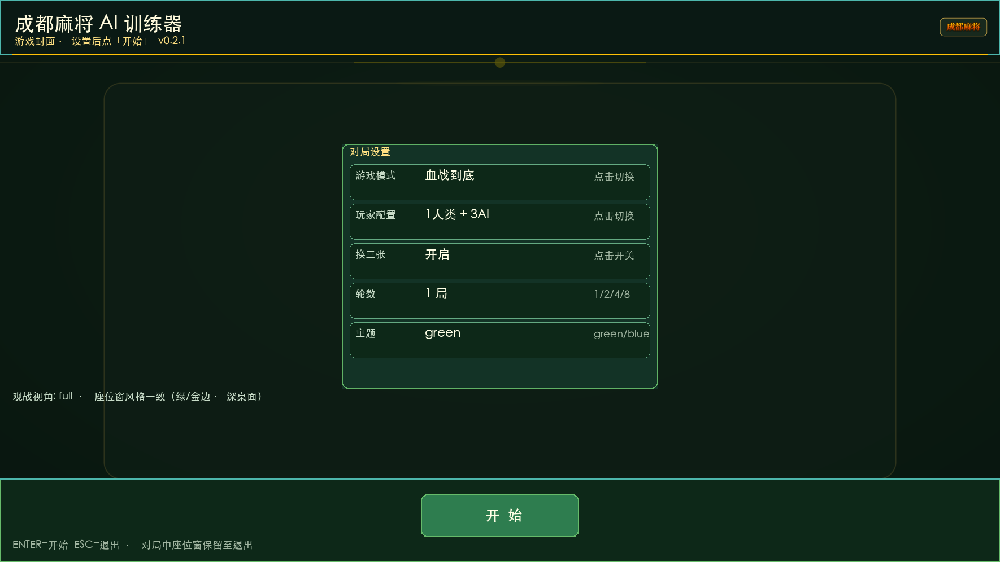

# 成都麻将 AI 训练器（血战到底）

基于 Python 的成都麻将（四川血战）模拟器：权威规则引擎、可插拔玩家、Pygame 界面、Human 子进程、存档/回放，以及面向强化学习的类 Gym 训练环境。

## 功能

- **引擎**：108 张（万筒条）、掷骰定庄、换三张、定缺、血战行牌、一炮多响、成都番型与可配置 `fan_cap`
- **计分 / Reward / JSONL**：可配置稠密与终局奖励，局级日志
- **玩家**：`random`、`rule_ai`、`rule_ai_plus`、`humanlike_v2`，以及 `human` 独立子进程座位窗（**1–3 人类** + AI，布局 A/B/C/D）
- **显示**：绿/蓝主题；主窗大厅/牌桌/结算；座位窗操作与观战；推荐出牌/进张；主窗掷骰动画与细化出牌日志
- **存档**：JSON 存档、逐步快照、崩溃策略
- **训练**：`ChengduMahjongEnv`（`reset` / `step` / `legal_actions`）+ 批跑 runner
- **分发**：Task 19 完成版本 [v0.3.0](https://github.com/moff1022-git/chengdu_majiang_AItrainer/releases/tag/v0.3.0)；历史 v0.2.1 仍提供 Windows/macOS 预构建包

## 四种 AI 模式

| AI 类型 | 核心逻辑 | 状态与记忆 | 决策特点 | 适用场景 |
|---|---|---|---|---|
| `random` | 在合法动作中随机选择 | 无长期计划和对手模型 | 最快、强度最低；作为随机基线 | 引擎压力测试、负向基线 |
| `rule_ai` | 胡/杠/碰优先，出牌以向听数和基础分析排序 | 仅使用当前局面 | 稳定、快速、可解释 | 基础规则 AI、回归基线 |
| `rule_ai_plus` | `rule_ai` 加 F0011/S2 牌型预测、危险度和综合弃牌评分 | 使用当前公开局面和增强分析；不是独立 Player 类 | 分析更深但计算耗时明显增加 | 强规则基线、能力对比 |
| `humanlike_v2` | PlayerView-only 候选评估 + 有界认知策略 | 按座位维护有限记忆、注意、计划、情绪和公开对手印象 | 允许可解释的合法次优选择，强调人类化、确定性和可审计性 | 人类化打法研究、训练与回放 |

### Humanlike v2 详细功能

- **有限信息边界**：决策只读取 `PlayerView v2` 可见字段，不访问对手暗手、牌墙真值或训练 oracle。
- **合法性优先**：强制动作和唯一合法动作不会被候选裁剪；所有认知扰动都必须产生合法动作。
- **独立座位认知**：s0-s3 分别维护认知状态，避免多个 AI 共享同一玩家记忆或人格。
- **有限记忆与遗忘**：记录公开事件和模糊对手印象，按容量和衰减规则遗忘，不保存隐藏信息。
- **注意与满意停止**：根据局面复杂度选择重点信息，在达到可接受方案后停止继续搜索，模拟有限计算资源。
- **主计划与备选计划**：结合牌质、定缺、速度、价值、防守和灵活性形成计划；局面显著变化时允许重启计划。
- **风格与状态变化**：保守、平衡、激进等 profile 会影响风险、候选和阈值；情绪与比分只作有界调整。
- **有界噪声**：只在分数接近的候选中产生可复现扰动；明显优劣局面不随机破坏最佳动作。
- **确定性复现**：相同配置、game_id、seat、决策序号和 PlayerView 序列产生相同动作、认知状态和 trace。
- **决策审计**：记录候选、评分、注意、计划、RNG 坐标、选择理由和耗时，可验证 hash 链并进行策略回放。
- **训练契约**：支持固定动作编码、合法 mask、PlayerView-only 观测以及真实得分与塑形奖励分离。
- **能力边界**：Humanlike 表示工程机制目标，不代表已经由真人牌谱证明真人相似度或竞技强度；MODEL-001 真人校准仍是独立后续功能。

### 界面预览

> 截图随版本刷新（[F0026](docs/features/F0026_readme_screenshots.md)）。本地重刷：  
> `.venv/bin/python tools/capture_readme_screenshots.py`

| 大厅 | 主窗口（游戏中） |
|:----:|:----------------:|
|  |  |

| 人类玩家（游戏中） | AI 玩家（游戏中） |
|:------------------:|:-----------------:|
|  |  |

| 计分窗口 |
|:--------:|
|  |

## 环境要求

- Python **3.11+**
- **Windows** 与 **macOS** 双端支持（屏幕检测 / 座位窗 / 中文 UI，见 [`docs/features/F0005_win_mac_compat.md`](docs/features/F0005_win_mac_compat.md)）
- 依赖见 `requirements.txt`（运行时需要 `pygame`；训练 env **不**依赖 gymnasium）
- macOS 座位窗需要 **tkinter**（Homebrew：`brew install python-tk@3.12`）

## 版本

- **当前应用版本**：**0.3.0**（权威：根目录 [`version.py`](version.py)）  
- **规则**：[docs/VERSIONING.md](docs/VERSIONING.md)（SemVer；与存档 schema / 座位协议分线）  
- **进度基线**：[docs/status/LATEST.md](docs/status/LATEST.md) · 变更：[docs/changelog.md](docs/changelog.md)  
- 查询：`.venv/bin/python main.py --version`

## 预构建下载（Release）

无需本机安装 Python，可直接使用发布包：

| 平台 | 推荐附件 | 说明 |
|------|----------|------|
| **Windows x64** | `ChengduMahjongAITrainer-0.2.1-windows-x64.msi` | **推荐安装包**（Program Files + 开始菜单） |
| **Windows x64** | `…-windows-x64-PyInstaller.zip` | 免安装绿色包，解压运行 `ChengduMahjongAITrainer.exe` |
| **Windows x64** | `…-windows-x64-Nuitka.zip` | 备选绿色包 |
| **macOS arm64** | `…-macOS-arm64-PyInstaller.zip` | 解压后打开 `.app`（必要时 `xattr -cr`） |
| **macOS arm64** | `…-macOS-arm64-Nuitka.zip` | 路径含中文时建议拷到 `/Applications` |

- **当前发布页**：[v0.3.0](https://github.com/moff1022-git/chengdu_majiang_AItrainer/releases/tag/v0.3.0)  
- **历史预构建包**：[v0.2.1](https://github.com/moff1022-git/chengdu_majiang_AItrainer/releases/tag/v0.2.1)  
- **Windows 日志**：`%APPDATA%\ChengduMahjongAITrainer\logs\`  
- **macOS 日志**：`~/Library/Application Support/ChengduMahjongAITrainer/logs/`  
- 未签名：Windows SmartScreen / macOS Gatekeeper 可能提示，从可信来源获取后「仍要运行」即可。

### Windows 解压运行（示例）

```powershell
Expand-Archive ChengduMahjongAITrainer-0.2.1-windows-x64-PyInstaller.zip -DestinationPath .
.\ChengduMahjongAITrainer\ChengduMahjongAITrainer.exe
.\ChengduMahjongAITrainer\ChengduMahjongAITrainer.exe --version
```

## 本机构建打包

### Windows（PyInstaller / Nuitka · F0025 Done）

须在 **Windows** 上构建（不支持 mac 交叉编译）。onedir + 同一 `exe` 带 `--seat-window` 拉起座位窗：

```powershell
.\tools\packaging\build_pyinstaller_windows.ps1   # → dist\pyinstaller\ChengduMahjongAITrainer\
.\tools\packaging\build_nuitka_windows.ps1         # → dist\nuitka\pyinstaller_entry.dist\（需 MSVC/MinGW）
.\tools\packaging\build_msi_windows.ps1            # → dist\msi\*.msi（WiX；基于 PyInstaller onedir）
# 或双击 tools\packaging\build_pyinstaller_windows.bat
```

说明与验收：[`docs/packaging/WINDOWS_BUILD.md`](docs/packaging/WINDOWS_BUILD.md) · 规格 [`F0025`](docs/features/F0025_windows_packaging.md) · MSI [`F0027`](docs/features/F0027_windows_msi.md)。

### macOS（PyInstaller / Nuitka · F0021 Done）

```bash
bash tools/packaging/build_pyinstaller_macos.sh   # → dist/pyinstaller/ChengduMahjongAITrainer.app
bash tools/packaging/build_nuitka_macos.sh         # → dist/nuitka/ChengduMahjongAITrainer.app
```

说明与验收：[`docs/packaging/MACOS_BUILD.md`](docs/packaging/MACOS_BUILD.md) · 规格 [`F0021`](docs/features/F0021_macos_packaging.md)。

## 安装（永久环境）

**权威解释器：项目根目录 `.venv`（Python 3.11+，推荐 3.12）。**  
完整说明见 [`docs/ENV.md`](docs/ENV.md)。

```bash
cd chengdu_majiang_AItrainer
bash tools/setup_venv.sh          # 创建/修复 .venv 并安装依赖
```

日常请始终用 venv，避免系统 Python 3.9：

```bash
.venv/bin/python main.py ...      # 推荐：不依赖 activate
# 或
source .venv/bin/activate
python main.py ...
```

可选：安装 [direnv](https://direnv.net/)，`direnv allow` 后进目录自动激活（见 `.envrc`）。  
编辑器：VS Code / Cursor 已配置 `.vscode/settings.json` → `.venv`。

可选依赖：`numpy`（观察向量）由 `setup_venv.sh` 尝试安装，或 ` .venv/bin/pip install numpy`。

## 快速开始

### 批跑 / 训练日志

```bash
.venv/bin/python main.py train --games 20 --players rule_ai,rule_ai,rule_ai,rule_ai --log-dir logs/demo --seed 0
# 或
.venv/bin/python -m training.runner --games 10 --players rule_ai,random,rule_ai,random --log-dir logs/demo
```

### GUI 观战 / 对局

```bash
.venv/bin/python main.py play --players rule_ai,rule_ai,rule_ai,rule_ai --theme green
```

- **多屏**：启动时检测**运行命令所在显示器**（控制台/光标），按该屏分辨率与工作区布局全部窗口  
- **主窗口 / 座位窗**：同一套 `plan`，落在当前屏工作区内（单屏区域 ≤2K），可拖拽缩放  
- 规格：[`docs/features/F0001_window_geometry.md`](docs/features/F0001_window_geometry.md)

### Human + 3 AI（主程序 + 玩家窗，完整 UI）

```bash
.venv/bin/python main.py human --theme green
# 等价：
.venv/bin/python main.py play --players human,rule_ai,rule_ai,rule_ai --theme green
# 2 人类 / 3 人类（F0020）：
# .venv/bin/python main.py play --players human,human,rule_ai,rule_ai
# .venv/bin/python main.py play --players human,human,human,rule_ai
```

会同时打开（F0002 完整 UI）：

1. **主程序窗口**：大厅 → 确认后**掷骰动画** → 全局观战 / HUD / 出牌日志  
2. **人类座位窗**（1–3 个 play）：换三张、定缺、出牌  
3. **AI 观战窗**（其余 watch）：只读 + 弃牌多行  

**S0 怎么操作：**

1. **换三张**：点 3 张同花色 →「确认换牌」；或 **「自动三张」**  
2. **定缺**：点 **万 / 筒 / 条**  
3. **出牌**：**双击**手牌直接打出（无确认按钮）；Enter 打出当前选中牌  
4. **碰/杠/胡**：有则点按钮；**仅能过时自动过**  

仅 headless 时加 `--headless`。

### 存档 / 观战

```bash
python main.py play --players rule_ai,rule_ai,rule_ai,rule_ai --save-dir saves
python main.py spectate --save saves/<game_id>.json
```

### 类 Gym 环境（Python API）

```python
from training.env import ChengduMahjongEnv

env = ChengduMahjongEnv(opponent_spec="rule_ai", num_players=4, seed=0)
obs = env.reset(game_id="train-demo-1")
done = False
while not done:
    legal = env.legal_actions()
    action = legal[0]  # 或策略选的 Action / dict / int 索引
    obs, reward, terminated, truncated, info = env.step(action)
    done = terminated or truncated
print(env.episode_result.scores)
env.close()
```

随机策略压测：

```bash
python -c "from training.env import smoke_random_episode; print(smoke_random_episode())"
```

`step` 返回 **Gymnasium 风格 5 元组**：`(obs, reward, terminated, truncated, info)`。  
默认对手为 **`rule_ai`**；可用 `opponent_spec="random"` 或 `opponents="rule_ai,random,rule_ai"`（不含 learner 座位）。

观察字典键：`game_id`, `seat`, `phase`, `view`, `legal_actions`, `request_id`。  
可选扁平向量：`from training.env import encode_obs_vector`。

## 目录结构

```text
chengdu_majiang_AItrainer/
├── engine/           # 规则与状态机（权威）
├── players/          # BasePlayer / random / rule_ai / human
├── protocols/        # 消息、视角过滤、传输
├── display/          # Pygame UI
├── training/         # JSONL、runner、env
├── configs/          # reward / fan / crash 等
├── assets/           # 牌面与 UI 贴图
├── tests/
├── main.py
├── PLAN.md
└── docs/
```

## 规则与配置要点

| 项 | 说明 |
|----|------|
| 人数 | 2 / 3 / 4 |
| 换三张 | 必换同花色三张 |
| 定缺 | 每人一门 |
| 一炮多响 | 默认开（`multi_ron`） |
| 番封顶 | `fan_cap`（0 = 不封顶） |
| Reward | `configs/reward_default.json` |
| 崩溃策略 | `configs/crash_policy.json` |

`game_id` 决定洗牌与骰点（可复现）。详见 `PLAN.md` 与 `docs/milestones/`。

## 开发规范

- **Docs-First**：规格确认后再写业务代码（`docs/DEVELOPMENT.md`、`AGENTS.md`）
- 里程碑索引：[`docs/milestones/README.md`](docs/milestones/README.md)
- 进度快照：[`docs/status/LATEST.md`](docs/status/LATEST.md)

## 测试

在**仓库根目录**执行（不要先 `cd tests`）：

```bash
pytest tests/ -q
# 或冒烟
pytest tests/test_window_geometry.py tests/test_asset_manager.py -q
```

## 许可证

Internal / TBD
