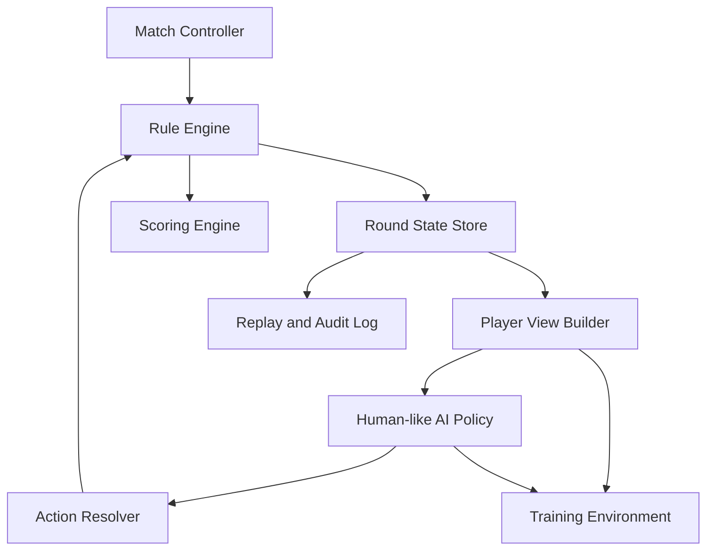
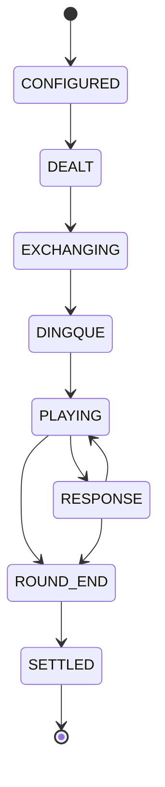

# 成都麻将AI训练模拟器程序实现规范

**实现规范版本：CDMJ-AI-IMPL 2.0.0**

**依赖规则版本：CDMJ-AI-RULES 1.0.0**

**依赖参数规范版本：CDMJ-AI-PARAMS 1.0.0**

**文档状态：程序实现基线**

## 0. 文档目的

本文档将《成都麻将AI人类化决策规则_v1.md》转换为可以直接指导程序设计、AI训练、自动测试和结果复现的工程规范。

本文档负责：

- 定义规则引擎、牌局状态、玩家视图和AI决策层的边界；
- 将`GP-001—GP-027`转换为程序配置；
- 将`RP-001—RP-033`转换为运行时状态；
- 定义完整的血战到底状态机和事件顺序；
- 定义合法行动、多人响应、碰杠胡和结算接口；
- 定义AI观测、候选行动、有限认知、评分和采样流程；
- 定义训练环境的观测空间、动作空间、奖励和回放格式；
- 解决源规则中自然语言和基础公式在工程实现时可能产生的歧义；
- 建立源规则章节、参数和程序模块之间的追踪关系。

本文档不重新发明麻将规则。所有业务语义来源于依赖规则文档；本文档只给出程序唯一解释。

## 1. 依赖文档与版本关系

### 1.1 规范层级

三个版本分别承担不同职责：

| 层级 | 版本 | 职责 |
|---|---|---|
| 决策语义 | `CDMJ-AI-RULES 1.0.0` | 定义AI应如何像人类一样观察、判断和行动 |
| 参数语义 | `CDMJ-AI-PARAMS 1.0.0` | 定义GP、RP参数的含义、范围和基础公式 |
| 程序实现 | `CDMJ-AI-IMPL 2.0.0` | 定义模块、状态、接口、算法顺序、训练环境和测试 |

### 1.2 源文件绑定

本实现规范绑定的源文件为：

- 文件：[成都麻将AI人类化决策规则_v1.md](./成都麻将AI人类化决策规则_v1.md)
- SHA-256：`6cbb4d4465abfd947b6cf7f1783db99408089d4e1646849a3afe674114267992`
- 文件内容版本：规则`1.0.0`，参数规范`1.0.0`

构建程序时必须保存源文件哈希。若实际源文件哈希不同，应停止构建并重新进行规范差异检查。

### 1.3 冲突裁决顺序

出现冲突时按以下顺序处理：

1. 麻将业务语义和合法行动，以`CDMJ-AI-RULES 1.0.0`为准；
2. 参数名称、范围和基础公式，以`CDMJ-AI-PARAMS 1.0.0`为准；
3. 牌张守恒、隐藏信息隔离和确定性回放属于不可违反的实现不变量；
4. 数据结构、字段命名、状态更新顺序和公式离散化，以本实现规范为准；
5. 平台差异必须通过GP配置表达，不得散落在代码条件中；
6. 无法按上述顺序消解的冲突必须报错，禁止静默选择默认规则。

## 2. 两份文档的一致性与歧义修正

下表是源规则与本实现规范之间的正式解释。它们不是对源文件的修改，而是程序层的唯一实现方式。

| 编号 | 源规则中的歧义或潜在冲突 | 本实现规范的裁决 |
|---|---|---|
| IR-001 | `RP-010`按手牌、弃牌和公开组合相加，可能重复计算补杠或已经进入公开组合的实体牌 | 所有实体牌使用唯一`tile_id`。可见牌统计按实体牌集合去重，再按牌种聚合 |
| IR-002 | `RP-018`将`4-V(x)`称为活牌，但这些牌可能在对手暗手中，并不全在牌墙 | 字段拆为`unseen_count`和`estimated_wall_live_count`；前者是确定上界，后者是基于未知牌分配模型的估计 |
| IR-003 | `RP-003`同时包含累计分和本局临时分，容易与`RP-030`、`RP-032`重复累计 | 分为`match_score_before_round`、`round_ledger`、`round_result`和`match_score_after_round`四层，禁止交叉重复计分 |
| IR-004 | `GP-026`限制候选数，但规则又要求强制行动不能被删除 | 候选上限只限制非强制候选。强制行动集合始终保留；若存在唯一强制行动，直接执行 |
| IR-005 | 注意力使用softmax后截取高权重项，截取后权重和不再为1 | 先计算显著度、选取Top-K，再仅对Top-K执行softmax归一化 |
| IR-006 | 剩余摸牌次数使用平均公式，碰牌、杠牌和后续胡牌会使预测变化 | 维护“假设后续无人改变顺序”的基准轮转及估计区间；任何碰杠胡事件后立即重算。不得把尚未发生的对手响应当作确定事件 |
| IR-007 | 记忆衰减公式中的`\(\Delta t\)`没有明确单位 | 记忆模型默认以“AI可见事件步数”为单位；真实毫秒只用于操作时间，不用于记忆衰减，除非另启用实时模式 |
| IR-008 | 响应示例曾使用“胡大于杠大于碰”，但参数规范允许平台差异 | 响应解析器完全读取`GP-008`；代码中不得硬编码杠和碰的相对优先级 |
| IR-009 | `GP-010`同时出现108张总牌与55张发牌后牌墙 | `total_tiles=108`，标准发牌总数53，`wall_remaining_after_deal=55`；二者是不同字段 |
| IR-010 | `RP-030`已含胡牌账本，`RP-032`再次合计时可能重复加入胡牌分 | `round_ledger`只记录逐事件增量；`round_result`从账本终值加终局专属调整生成，不再重复计算普通胡牌 |
| IR-011 | 对手是否清缺属于隐藏状态，但规则需要威胁判断 | 自己清缺使用确定布尔值；对手只保存`cleared_probability`，除非公开信息能规则性证明 |
| IR-012 | 暗杠对外是否可见因平台不同，但引擎必须知道真实牌 | 引擎保存完整真实状态；每个AI通过`PlayerViewBuilder`获得按`GP-021`脱敏后的独立视图 |
| IR-013 | 碰、明杠、暗杠、补杠对手牌张数的变化容易混为一个公式 | 每类动作使用独立状态转移函数和独立牌张守恒断言 |
| IR-014 | 牌局阶段使用牌墙比例，但牌墙余量可能只部分可见 | 引擎阶段使用真实值；AI阶段判断只能使用公开值或区间中点，并在观测中标记`estimated=true` |
| IR-015 | 参数规范称27个GP和33个RP已完整，但实现仍需要派生特征 | 派生特征作为RP对象内部字段，不增加外部顶层参数编号；训练特征必须标注来源参数和计算版本 |
| IR-016 | 规则允许满意停止，不等同于始终选最高候选分 | 决策器先按认知顺序检查候选；达到停止阈值立即返回。只有未触发满意停止时才在已检查集合中取最高分 |
| IR-017 | “未见牌数”可用于概率近似，但未知牌并非均匀位于牌墙 | 训练时可以使用精确隐藏状态评估模型误差，但策略输入只能使用均匀先验或公开行为修正后的主观分布 |
| IR-018 | 终局公开信息可能在复盘时泄漏到局中决策记录 | 决策快照不可变；终局信息写入新的复盘记录，不得覆盖历史观测 |

经上述裁决，两份文档不存在无法解决的业务矛盾。所有差异均属于数据层级、命名、概率解释或状态更新顺序的工程歧义。

## 3. 总体系统架构

系统划分为九个核心模块：



### 3.1 Match Controller

负责：

- 加载并锁定全部GP；
- 创建四名玩家和AI档案；
- 创建每一局；
- 管理累计比分；
- 根据`GP-003`判断整场结束；
- 保存规则、参数、实现版本和随机种子。

### 3.2 Rule Engine

负责：

- 牌张守恒；
- 发牌、换三张和定缺合法性；
- 摸牌、出牌、碰、杠、胡合法性；
- 过胡状态；
- 多人响应；
- 血战到底的玩家退出和继续轮转；
- 终局条件。

规则引擎不得包含AI风格、记忆和情绪逻辑。

### 3.3 Round State Store

保存完整真实状态，包括所有隐藏牌。只有规则引擎、结算引擎和训练评估器可以读取完整状态。

### 3.4 Player View Builder

针对每名玩家创建独立、不可越权的观测：

- 自己手牌；
- 公开弃牌和碰杠；
- 定缺结果；
- 允许公开的牌墙信息；
- 允许公开的暗杠和胡牌信息；
- 当前合法行动；
- 当前操作时限。

任何AI策略不得直接持有`RoundState`引用。

### 3.5 Human-like AI Policy

按以下顺序运行：

1. 更新有限记忆；
2. 更新注意力；
3. 更新手牌结构；
4. 更新对手假设；
5. 更新做牌主计划和备选计划；
6. 从合法行动生成认知候选；
7. 按玩家水平进行有限推演；
8. 执行满意停止或候选比较；
9. 应用可复现的人类化扰动；
10. 输出行动和决策记录。

### 3.6 Action Resolver

收集响应窗口内的行动，按`GP-008`解析优先级，形成一个确定的规则事件。

### 3.7 Scoring Engine

根据`GP-011—GP-020`结算胡牌、杠分、呼叫转移、花猪、查大叫和退税。

### 3.8 Replay and Audit Log

保存事件、状态哈希、玩家观测哈希、合法行动、候选行动、随机数位置、最终动作和计分增量。

### 3.9 Training Environment

将同一规则引擎包装为单智能体、多智能体或自博弈环境，不改变生产牌局逻辑。

## 4. 核心领域模型

### 4.1 牌种编码

牌种使用0—26的连续整数：

| 范围 | 花色 | 点数换算 |
|---|---|---|
| 0—8 | 万 | `rank = tile_type + 1` |
| 9—17 | 筒 | `rank = tile_type - 8` |
| 18—26 | 条 | `rank = tile_type - 17` |

每张实体牌具有唯一编号：

```text
tile_id = tile_type * 4 + copy_index
copy_index ∈ {0,1,2,3}
tile_id ∈ [0,107]
```

业务逻辑使用`tile_type`；牌张守恒和可见牌去重使用`tile_id`。

### 4.2 玩家编号与座位

- 玩家编号固定为0—3，不随庄家变化；
- `seat_order`保存当前局的顺序；
- 上家、对家、下家均相对于观察者计算；
- 玩家胡牌后不删除玩家对象，只将状态改为`HU_EXITED`；
- 活动顺序由`active_seats`维护。

### 4.3 手牌与组合

真实手牌同时保存：

- `concealed_tile_ids`：实体牌ID集合；
- `tile_type_counts[27]`：聚合计数；
- `melds`：碰、明杠、暗杠、补杠；
- `dingque_suit`；
- `pass_hu_state`。

`tile_type_counts`必须由实体牌集合生成，不能独立修改。

### 4.4 可见牌集合

对玩家\(p\)：

```text
visible_tile_ids(p)
  = own_concealed_tiles(p)
  ∪ all_discards
  ∪ public_meld_tiles
  ∪ allowed_public_hu_tiles
  ∪ allowed_public_concealed_gang_tiles
```

先对`tile_id`去重，再聚合为`visible_count[27]`。

### 4.5 得分对象

必须分离：

```text
match_score_before_round[4]
round_ledger[4]
round_end_adjustments[4]
round_result[4]
match_score_after_round[4]
```

关系为：

```text
round_result = round_ledger + round_end_adjustments
match_score_after_round = match_score_before_round + round_result
```

禁止把`round_result`再次加入`round_ledger`。

## 5. 配置模型

### 5.1 配置文件

建议使用JSON、YAML或强类型配置对象。配置必须包含：

```yaml
rule_version: CDMJ-AI-RULES 1.0.0
parameter_version: CDMJ-AI-PARAMS 1.0.0
implementation_version: CDMJ-AI-IMPL 2.0.0
ruleset: chengdu_xuezhan_daodi
global_parameters:
  GP-001: {}
  GP-002: {}
  # ...
  GP-027: {}
players:
  - player_id: 0
    profile: {}
  - player_id: 1
    profile: {}
  - player_id: 2
    profile: {}
  - player_id: 3
    profile: {}
seed: 0
```

### 5.2 配置校验

启动整场游戏前：

1. 校验GP-001—GP-027全部存在；
2. 校验规则和参数版本；
3. 校验所有枚举；
4. 校验数值范围；
5. 校验番型关系无循环冲突；
6. 校验权重归一化；
7. 校验超时默认动作合法；
8. 生成配置规范化副本；
9. 计算配置SHA-256；
10. 在整场游戏期间冻结配置对象。

浮点权重总和与1的允许误差为\(10^{-6}\)。

## 6. 每轮运行时状态

### 6.1 RoundState

```typescript
interface RoundState {
  roundId: string;
  eventIndex: number;
  dealerId: number;
  currentActorId: number | null;
  phase: RoundPhase;
  wallTileIds: number[];
  players: PlayerRoundState[];
  discards: DiscardEvent[];
  responseWindow: ResponseWindow | null;
  winners: HuRecord[];
  roundLedger: [number, number, number, number];
  roundEndAdjustments: [number, number, number, number];
  terminalReason: TerminalReason | null;
}
```

### 6.2 PlayerRoundState

```typescript
interface PlayerRoundState {
  playerId: number;
  status: "ACTIVE" | "HU_EXITED";
  concealedTileIds: number[];
  melds: Meld[];
  exchangedOutTileIds: number[];
  exchangedInTileIds: number[];
  dingqueSuit: "wan" | "tong" | "tiao" | null;
  passHuState: PassHuState;
  decisionMemory: DecisionMemory;
  roundEmotion: number;
}
```

### 6.3 PlayerView

```typescript
interface PlayerView {
  playerId: number;
  eventIndex: number;
  ownTileTypeCounts: number[];
  ownMelds: MeldView[];
  publicMelds: MeldView[][];
  discards: DiscardView[];
  dingqueSuits: Array<"wan" | "tong" | "tiao">;
  activePlayers: number[];
  huRecords: HuRecordView[];
  wallRemainingExact?: number;
  wallRemainingRange?: [number, number];
  legalActions: LegalAction[];
  responseDeadlineMs?: number;
}
```

`PlayerView`构建完成后执行隐藏信息审计。任何不属于`GP-021`公开范围的字段都必须不存在，而不是置入真实值后依靠AI忽略。

AI默认不接收自己的实体`tile_id`，因为同种牌的四个副本在策略上不可区分。策略提交`tile_type`，规则引擎从该玩家的合法手牌中确定性选择一个对应实体牌。

## 7. 血战到底状态机



### 7.1 状态定义

| 状态 | 允许事件 |
|---|---|
| `CONFIGURED` | 定庄、洗牌、建立牌墙 |
| `DEALT` | 发牌、初始状态校验 |
| `EXCHANGING` | 四家提交换三张、统一交换 |
| `DINGQUE` | 四家提交定缺 |
| `PLAYING` | 摸牌、自摸检查、暗杠、补杠、出牌 |
| `RESPONSE` | 点炮胡、抢杠胡、明杠、碰、过 |
| `ROUND_END` | 花猪、查大叫、退税及终局调整 |
| `SETTLED` | 生成结果、复盘和跨局学习输出 |

### 7.2 标准事件顺序

1. 创建牌墙；
2. 发牌，庄家14张、其他玩家13张；
3. 四家同时选择换出牌；
4. 统一执行换牌；
5. 四家同时提交定缺；
6. 庄家执行首轮出牌；
7. 打开响应窗口；
8. 解析胡、杠、碰或无人响应；
9. 若无人改变顺序，下一活动玩家摸牌；
10. 摸牌后依次检查自摸、暗杠、补杠和出牌；
11. 某家胡牌后退出摸打并重建活动顺序；
12. 三家胡牌或牌墙达到终止条件；
13. 执行终局结算；
14. 生成不可变回放。

### 7.3 原子事件

每次状态变化只对应一个原子事件：

```text
DEAL
EXCHANGE_SUBMIT
EXCHANGE_RESOLVE
DINGQUE_SUBMIT
DINGQUE_RESOLVE
DRAW
DISCARD
RESPONSE_OPEN
RESPONSE_SUBMIT
RESPONSE_RESOLVE
PENG
MING_GANG
AN_GANG
BU_GANG_DECLARE
QIANG_GANG_HU
GANG_SUPPLEMENT_DRAW
HU
PLAYER_EXIT
ROUND_TERMINATE
ROUND_ADJUST
ROUND_SETTLE
```

每个事件执行后计算状态哈希并运行断言。

## 8. 规则引擎与动作解析

### 8.1 合法行动生成

```pseudo
function legal_actions(state, player):
    assert player is active
    actions = []

    if state.phase == PLAYING and state.current_actor == player:
        if can_hu_self_draw(state, player):
            actions += HU_SELF_DRAW
        actions += legal_concealed_gangs(state, player)
        actions += legal_added_gangs(state, player)
        actions += legal_discards_respecting_dingque(state, player)

    if state.phase == RESPONSE and player in response_window.eligible_players:
        actions += legal_hu_responses(state, player)
        actions += legal_gang_responses(state, player)
        actions += legal_peng_responses(state, player)
        actions += PASS

    return enforce_pass_hu_and_forced_hu(actions, state, player)
```

不能生成`CHI`动作。

### 8.2 定缺出牌

```pseudo
if count_tiles_in_dingque_suit(hand) > 0:
    legal_discards = all tiles in dingque suit
else:
    legal_discards = all concealed tiles
```

未清缺时：

- `HU`动作不合法；
- 对手威胁模型中的当前合法胡牌概率为0；
- 仍可按规则执行合法碰杠，但不得借此绕过缺门约束。

### 8.3 碰牌

碰牌转移：

```text
hand -= two matching tile_ids
melds += PENG(two hand tiles + discarded tile)
discarded tile owner remains recorded
current actor = peng player
peng player must discard
```

### 8.4 明杠

弃牌直杠：

```text
hand -= three matching tile_ids
melds += MING_GANG(three hand tiles + discarded tile)
apply gang ledger event
perform supplement draw
```

### 8.5 暗杠

```text
hand -= four matching tile_ids
melds += AN_GANG(four hand tiles)
publish according to GP-021
apply gang ledger event
perform supplement draw
```

### 8.6 补杠与抢杠胡

补杠必须分成声明和完成两个阶段：

1. 从手牌选择第四张；
2. 产生`BU_GANG_DECLARE`；
3. 打开抢杠胡响应窗口；
4. 若有人抢杠胡，取消补杠完成并按规则处理牌张；
5. 若无人胡，将碰组替换为补杠组；
6. 结算杠分并补牌。

### 8.7 多人响应解析

```pseudo
function resolve_responses(window, submissions, GP_008):
    valid = validate_each_submission(submissions)
    hu_actions = valid where action is HU

    if hu_actions not empty:
        if GP_008.multi_hu:
            return all hu_actions ordered by deterministic seat rule
        return highest_priority_hu(hu_actions)

    return resolve_peng_gang_by_config(valid, GP_008)
```

调用顺序、网络返回顺序和AI计算快慢不得影响结果。

## 9. AI决策管线

### 9.1 决策上下文

AI每次只接收：

```typescript
interface DecisionContext {
  view: PlayerView;
  globalConfig: Readonly<GlobalConfig>;
  profile: Readonly<AIProfile>;
  memory: DecisionMemory;
  emotion: number;
  rng: DeterministicRng;
}
```

### 9.2 决策步骤

```pseudo
function decide(context):
    assert no hidden information in context.view

    memory = update_memory(context)
    attention = update_attention(context, memory)
    structures = analyze_hand(context.view)
    beliefs = update_opponent_beliefs(context, attention)
    threat = evaluate_threat(context, beliefs)
    plan = update_plan(context, structures, beliefs, threat)

    legal = context.view.legal_actions
    mandatory = mandatory_actions(legal)
    if mandatory has exactly one action:
        return record_and_return(mandatory[0])

    candidates = cognitive_prune(
        legal,
        plan,
        attention,
        context.profile
    )

    checked = []
    for action in ordered_by_human_salience(candidates):
        evaluation = limited_lookahead(action)
        checked.append(evaluation)
        if satisfaction(evaluation) >= stop_threshold(context.profile):
            return record_and_return(action, "satisficing")
        if time_near_deadline():
            break

    action = select_best_checked_with_bounded_noise(checked)
    return record_and_return(action, "best_checked")
```

### 9.3 强制行动与候选上限

```text
candidates = mandatory_actions ∪ top_k(optional_actions)
```

`K`只限制可选行动。强制行动不能因候选上限、注意力或人类失误被删除。

### 9.4 人类化扰动

扰动只能用于评分差距不超过`near_equivalent_threshold`的候选：

```text
if abs(Q(a) - Q(b)) <= threshold:
    apply deterministic bounded noise
else:
    preserve original ordering
```

随机数必须来自整场主种子派生的玩家决策流：

```text
decision_seed = hash(match_seed, round_id, player_id, event_index, decision_index)
```

## 10. 派生指标实现

### 10.1 手牌分析

`HandAnalyzer`至少输出：

- 标准牌型向听；
- 七对向听；
- 当前房间启用特殊牌型的可行状态；
- 所有有效拆解或受水平限制的Top-N拆解；
- 完成组合、搭子、对子和候选将牌；
- 每种合法弃牌后的向听变化；
- 等待形状。

规则引擎使用完整精确分析；人类化AI可以根据水平只看到Top-N拆解。

### 10.2 未见牌与估计活牌

确定值：

```text
unseen_count[x] = 4 - visible_count[x]
```

主观估计：

```text
estimated_wall_live_count[x]
  = unseen_count[x] * estimated_wall_remaining / estimated_unknown_region_size
```

其中：

```text
estimated_unknown_region_size
  = estimated_wall_remaining
  + estimated_opponent_concealed_tile_count
```

所有结果限制在0—`unseen_count[x]`。

`dead_wait=true`只在规则性确定所有等待牌均已可见时成立。仅仅估计牌在对手手中不能标记为确定死叫。

### 10.3 对手清缺概率

自己清缺为确定状态。对手清缺使用：

```text
P_cleared_new
  = clip(
      P_cleared_old
      + evidence_gain
      - contradiction_penalty,
      0,
      1
    )
```

规则性确定仍在打缺门时，当前胡牌概率为0；无法证明时保留不确定性。

### 10.4 对手假设

对每名对手独立维护：

```text
normal_two_suit
main_suit_wan
main_suit_tong
main_suit_tiao
qingyise
qidui
duiduihu
configured_special_pattern
ting
not_ting
```

证据更新使用参数规范中的贝叶斯公式。为避免单次行为过度确定：

```text
posterior = (1 - evidence_cap) * prior + evidence_cap * bayes_posterior
evidence_cap ∈ [0,1]
```

### 10.5 风险

单家风险：

```text
risk(player, tile)
  = P(player_can_legally_hu)
  * P(player_is_ting)
  * P(tile_is_wait | ting)
  * normalized_loss
```

多家综合风险：

```text
combined_risk(tile)
  = 1 - product(1 - risk(player, tile))
```

该风险是主观估计，不允许使用真实隐藏手牌进行线上决策。

### 10.6 注意力

正确顺序：

1. 为全部可见对象计算显著度；
2. 选出容量允许的Top-K对象；
3. 仅在Top-K内部执行softmax；
4. 将其余对象标记为低关注，不删除历史事实。

### 10.7 记忆

默认使用事件步数：

```text
memory_strength_new
  = clip(
      memory_strength_old * exp(-decay * visible_event_steps)
      + reinforcement * salience,
      0,
      1
    )
```

已遗忘内容不能在没有新公开提示时恢复为精确记忆。

### 10.8 剩余摸牌机会

维护“后续无人碰杠胡”的基准轮转：

```pseudo
simulate current active turn order until wall end
count DRAW events assigned to each active player
```

该结果只是基准估计，不是未来行动的确定预测。系统同时保存估计下界和上界；任何碰、杠、胡事件发生后，使用新的活动顺序重新计算。无法展开基准轮转时使用：

```text
estimated_draws = clip(ceil((wall - offset) / active_count), 0, wall)
```

### 10.9 候选行动评价

沿用参数规范评价项：

```text
Q(action)
  = w_speed * speed_gain
  + w_live * live_gain
  + w_fan * fan_gain
  + w_safety * safety_gain
  + w_plan * plan_fit
  + w_match * match_utility
  + bounded_noise
```

所有评价项先归一化到`[-1,1]`，所有权重在`[0,1]`且总和为1。

## 11. AI训练环境

### 11.1 训练模式

支持：

- 规则AI对规则AI；
- 学习AI对规则AI；
- 单智能体固定对手；
- 四智能体自博弈；
- 离线行为克隆；
- 回放强化学习；
- 对手风格域随机化。

### 11.2 观测空间

推荐观测由以下部分组成：

| 观测块 | 建议表示 |
|---|---|
| 自己手牌 | `27 × 5` one-hot计数或27维计数 |
| 自己公开组合 | 按组合类型和牌种编码 |
| 四家定缺 | `4 × 3` one-hot |
| 四家弃牌 | 保留顺序的事件序列和27维聚合 |
| 四家公开组合 | 玩家、类型、牌种、来源 |
| 活动玩家 | 4维布尔值 |
| 当前玩家和座位 | one-hot |
| 牌墙信息 | 精确值或上下界及可见性标记 |
| 过胡状态 | 状态枚举 |
| 合法行动掩码 | 与动作空间等长 |
| 当前比分 | 标准化四人分数 |
| AI内部状态 | 计划、注意力、记忆、情绪，可按训练目标选择是否输入 |

生产策略观测必须来自`PlayerView`。训练评估器可以另外读取隐藏状态计算诊断指标，但不得拼入策略观测。

### 11.3 动作空间

推荐使用结构化动作：

```text
PASS
HU
PENG(tile_type)
MING_GANG(tile_type)
AN_GANG(tile_type)
BU_GANG(tile_type)
DISCARD(tile_type)
EXCHANGE(tile_type_a, tile_type_b, tile_type_c)
DINGQUE(suit)
```

所有动作必须带合法行动掩码。训练环境收到非法动作时：

- 生产模式：拒绝并记录程序错误；
- 强化学习模式：返回负奖励并按配置选择重新采样或终止该episode；
- 不得自动把非法动作映射为另一个合法动作而不留记录。

### 11.4 奖励

最终奖励以真实结算为主：

```text
terminal_reward
  = normalized_round_score
  + match_rank_component
```

允许添加势能型辅助奖励：

```text
potential(state)
  = c1 * normalized_shanten_improvement
  + c2 * normalized_live_wait_improvement
  + c3 * dingque_progress
  - c4 * discard_risk
```

单步塑形奖励：

```text
shaping_reward
  = discount * potential(next_state) - potential(current_state)
```

约束：

- 辅助奖励不能奖励非法信息利用；
- 花猪、未叫、点炮和呼叫转移必须来自真实计分；
- 不建议单独奖励“碰”或“杠”，避免形成能碰必碰；
- 训练评估必须同时报告无塑形的真实得分。

### 11.5 Episode

- 一局血战到底可以作为一个episode；
- 整场多局比赛可以作为带跨局状态的长episode；
- 跨局训练时只继承源规则允许的比分、风格印象和情绪余效；
- 牌墙和隐藏手牌在每局开始时重新随机。

## 12. 日志、回放与可复现

### 12.1 事件日志

每个事件记录：

```json
{
  "match_id": "string",
  "round_id": "string",
  "event_index": 0,
  "event_type": "DISCARD",
  "actor_id": 0,
  "public_payload": {},
  "private_payload_hash": "sha256",
  "state_hash_before": "sha256",
  "state_hash_after": "sha256",
  "config_hash": "sha256"
}
```

### 12.2 AI决策日志

记录：

- 玩家视图哈希；
- 记忆摘要；
- 注意力对象；
- 主计划和备选计划；
- 合法行动；
- 实际候选；
- 已检查候选；
- 每项评分；
- 停止原因；
- 随机种子位置；
- 最终动作；
- 思考耗时。

不得把完整隐藏状态写入AI决策输入字段。

### 12.3 确定性回放

相同的：

- 规则配置；
- 参数配置；
- 实现版本；
- 初始随机种子；
- 玩家策略版本；
- 事件序列；

必须产生相同的牌墙、状态、动作和结算。

## 13. 程序接口

### 13.1 规则引擎

```typescript
interface RuleEngine {
  createMatch(config: GlobalConfig, seed: bigint): MatchState;
  startRound(match: MatchState): RoundState;
  legalActions(state: RoundState, playerId: number): LegalAction[];
  applyEvent(state: RoundState, event: GameEvent): RoundState;
  openResponseWindow(state: RoundState): ResponseWindow;
  resolveResponses(state: RoundState, submissions: ActionSubmission[]): GameEvent[];
  isTerminal(state: RoundState): boolean;
}
```

### 13.2 玩家视图

```typescript
interface PlayerViewBuilder {
  build(
    state: RoundState,
    playerId: number,
    visibility: VisibilityConfig
  ): PlayerView;
}
```

### 13.3 AI策略

```typescript
interface MahjongPolicy {
  decide(context: DecisionContext): DecisionResult;
}

interface DecisionResult {
  action: LegalAction;
  trace: DecisionTrace;
}
```

### 13.4 计分

```typescript
interface ScoringEngine {
  scoreHu(state: RoundState, hu: HuEvent): ScoreDelta;
  scoreGang(state: RoundState, gang: GangEvent): ScoreDelta;
  scoreTransfer(state: RoundState, event: GameEvent): ScoreDelta;
  scoreRoundEnd(state: RoundState): RoundEndAdjustments;
  finalize(state: RoundState): RoundResult;
}
```

### 13.5 训练环境

```typescript
interface MahjongTrainingEnv {
  reset(seed?: bigint): ObservationMap;
  step(actions: ActionMap): StepResult;
  legalActionMask(playerId: number): boolean[];
  cloneState(): SerializableState;
  restoreState(snapshot: SerializableState): void;
}
```

## 14. 断言与测试

### 14.1 每事件强制断言

每个事件后检查：

1. 108张实体牌各出现且只出现一次；
2. 每种牌总数固定4；
3. 手牌和组合张数符合动作；
4. 当前行动者仍是活动玩家；
5. 已胡玩家不再摸打；
6. 未清缺玩家不能胡；
7. 候选行动属于合法行动；
8. AI视图不含隐藏字段；
9. 账本符合零和或明确的外部奖励声明；
10. 状态机没有非法跳转。

### 14.2 单元测试

至少覆盖：

- 三种换牌方向；
- 各种花色数量下换三张合法性；
- 定缺后强制出缺门；
- 清缺前禁止胡牌；
- 碰牌后的手牌和顺序；
- 明杠、暗杠、补杠；
- 抢杠胡成功和失败；
- 一炮多响；
- 过胡状态恢复；
- 最后若干张强制胡牌；
- 三家胡牌终止；
- 牌墙流局；
- 花猪、查大叫、退税；
- 呼叫转移；
- 封顶；
- 胡牌后公开信息差异；
- 可见牌实体去重；
- 死叫；
- 候选强制行动保留；
- 确定性随机回放。

### 14.3 属性测试

随机生成合法牌局并验证：

```text
sum(all physical tile locations) == 108
count(tile_type) == 4
legal_action_mask contains chosen action
hidden_information_leak_count == 0
same_seed_same_trace == true
```

### 14.4 对照测试

为每个源规则章节建立固定案例：

- 输入完整GP和RP；
- 保存期望合法行动；
- 保存期望状态转移；
- 保存期望结算；
- 保存不同AI档案的允许行为范围；
- 不要求人类化AI每次选择唯一相同动作，但必须落在允许候选集合内。

### 14.5 训练回归指标

至少报告：

- 非法动作率，目标为0；
- 隐藏信息泄漏率，目标为0；
- 牌张守恒失败率，目标为0；
- 规则结算差异率，目标为0；
- 相同种子复现率，目标为100%；
- 平均首胡率、胡牌率、花猪率和未叫率；
- 平均番数、杠率、碰率、过胡率；
- 不同风格AI行为差异；
- 与真人数据的弃牌分布、思考时间和牌型选择差异。

## 15. 源规则追踪矩阵

| 源规则章节 | 主要GP/RP | 实现模块 |
|---|---|---|
| 第0—2章：范围与学习规则 | GP-001—GP-027 | 配置加载、配置校验、版本锁定 |
| 第3章：定庄与座位 | GP-020、RP-002 | Match Controller、Turn Scheduler |
| 第4章：初始手牌 | GP-004、RP-004、RP-016 | Dealer、Hand Analyzer |
| 第5章：换三张 | GP-005、RP-005 | Exchange Resolver、AI Exchange Policy |
| 第6章：定缺 | GP-006、RP-006 | Dingque Resolver、Legality Filter |
| 第7章：做牌方向 | GP-011—GP-027、RP-016—RP-022 | Plan Manager、Pattern Analyzer |
| 第8章：算牌 | GP-021—GP-026、RP-007—RP-025 | View Builder、Belief Model、Threat Model |
| 第9章：胡杠碰 | GP-007—GP-016、RP-013—RP-030 | Action Resolver、Response Window |
| 第10章：出牌 | RP-016—RP-029 | Candidate Generator、Policy、Lookahead |
| 第11章：胡牌 | GP-009—GP-019、RP-030—RP-031 | Hu Validator、Scoring Engine |
| 第12章：终局计分 | GP-010—GP-020、RP-030—RP-033 | Round Finalizer |
| 第13章：玩家模型 | GP-023—GP-026、RP-024—RP-033 | Profile Store、Memory、Emotion |
| 第14章：有限认知 | GP-026、RP-023—RP-029 | Cognitive Policy |
| 第15章：总体流程 | 全部 | Match Controller、Round State Machine |
| 第16章：实现接口 | 全部 | 本实现规范 |
| 第17章：参数注册 | GP-001—GP-027、RP-001—RP-033 | Config Schema、Runtime Schema |
| 第18章：数值公式 | GP-023—GP-027、RP-016—RP-033 | Feature Calculator、Policy Evaluator |

### 15.1 参数到代码的追踪要求

每个配置字段必须声明：

```text
parameter_id
schema_path
default_policy
validation_rule
consuming_modules
test_case_ids
```

每个派生特征必须声明：

```text
source_parameter_ids
formula_version
visibility_level
normalization_range
training_feature_index
```

## 16. 推荐项目结构

```text
src/
  config/
    schema
    validators
    defaults
  domain/
    tiles
    players
    events
    state
  rules/
    legality
    exchange
    dingque
    response
    turn_scheduler
  scoring/
    patterns
    hu
    gang
    round_end
  view/
    player_view_builder
    visibility_audit
  ai/
    hand_analyzer
    plan_manager
    belief_model
    threat_model
    memory
    attention
    candidate_generator
    evaluator
    policy
  training/
    environment
    observations
    action_mask
    rewards
    self_play
  replay/
    event_log
    snapshots
    deterministic_rng
  tests/
    unit
    property
    regression
    rule_traceability
```

## 17. 实施顺序

### 第一阶段：确定性规则内核

- 实体牌和牌墙；
- 发牌、换三张和定缺；
- 摸打、碰杠胡；
- 血战顺序；
- 计分和终局；
- 回放和断言。

验收条件：规则测试全部通过，不接入人类化AI。

### 第二阶段：完美信息隔离

- PlayerView；
- GP-021可见性；
- 隐藏信息审计；
- AI只能通过PlayerView行动。

验收条件：隐藏信息泄漏率为0。

### 第三阶段：基础策略AI

- 手牌分析；
- 向听、等待和未见牌；
- 做牌计划；
- 合法候选；
- 确定性最高评分策略。

验收条件：AI能完成大量合法自博弈牌局。

### 第四阶段：人类化认知

- 有限候选；
- 注意力；
- 记忆；
- 对手假设；
- 满意停止；
- 情绪和偏好；
- 有界扰动。

验收条件：不同档案产生稳定、可解释的行为差异。

### 第五阶段：训练接口

- 观测和动作空间；
- 合法动作掩码；
- 奖励；
- 自博弈；
- 离线数据；
- 策略版本管理。

验收条件：训练与生产共用同一规则引擎。

## 18. 发布与变更管理

### 18.1 版本升级

- 规则语义变化：升级`CDMJ-AI-RULES`；
- 参数含义或范围变化：升级`CDMJ-AI-PARAMS`；
- 程序接口、模块或算法实现变化：升级`CDMJ-AI-IMPL`；
- 仅修正文案且不影响行为：增加文档修订号。

### 18.2 兼容性

程序启动时必须校验三种版本组合是否受支持。未知版本组合必须拒绝运行。

### 18.3 发布物

每次发布至少包含：

- 三种版本号；
- 源规则文件哈希；
- 配置Schema；
- 默认配置；
- 测试报告；
- 回放格式版本；
- 策略模型版本；
- 已知差异和迁移说明。

## 19. 完成定义

只有同时满足以下条件，才能认为实现符合本规范：

- 所有合法规则均由配置驱动；
- 牌张守恒和状态机无错误；
- AI无法读取隐藏信息；
- 多人响应与血战顺序确定；
- 计分可审计且不重复；
- GP和RP均可追踪到程序字段；
- 人类化AI使用有限候选而非全知穷举；
- 相同种子可以完整复现；
- 规则回归测试、属性测试和训练回归测试通过；
- 源规则哈希与本规范绑定值一致。
